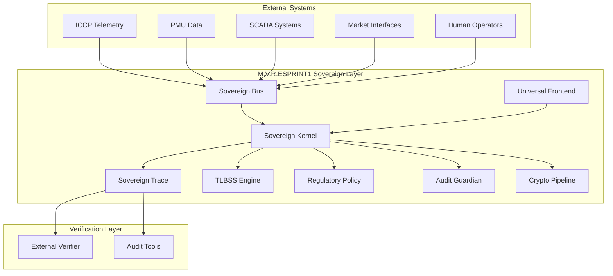

# M.V.R.ESPRINT1 Architecture Design Document

**Deterministic Assurance Overlay for Grid Operations**

*Version 0.1.0 – March 2026*

---

## Table of Contents

1. [Executive Summary](#executive-summary)
2. [System Overview](#system-overview)
3. [Architectural Principles](#architectural-principles)
4. [High-Level Architecture](#high-level-architecture)
5. [Component Architecture](#component-architecture)
6. [Data Architecture](#data-architecture)
7. [Security Architecture](#security-architecture)
8. [Deployment Architecture](#deployment-architecture)
9. [Performance Architecture](#performance-architecture)
10. [Interface Architecture](#interface-architecture)
11. [Operational Architecture](#operational-architecture)
12. [Evolution and Extensibility](#evolution-and-extensibility)

---

## Executive Summary

M.V.R.ESPRINT1 is a sovereign execution system designed as a deterministic assurance overlay for energy grid operations. It provides cryptographically verifiable event reconstruction, tamper-evident audit trails, and physics-based stability modeling while maintaining zero operational risk through shadow-mode operation.

The system implements a comprehensive governance framework that enhances existing grid infrastructure without requiring operational changes, focusing on risk reduction and evidence improvement for regulatory compliance.

---

## System Overview

### Purpose and Scope

M.V.R.ESPRINT1 serves as a deterministic governor for the energy sector, implementing:

- **Sovereign Kernel**: Core deterministic runtime with 1kHz control loops
- **TLBSS Integrity Engine**: Tri-Entity Boundary Stability System for grid physics modeling
- **Regulatory Policy Engine**: NERC/CIP/ISO compliance with legal citation tracking
- **Audit Guardian**: Non-agentic boundary certification and admissibility checking
- **Adversarial Harness**: Security testing against state corruption and authority escalation
- **Universal Execution Layer**: Cryptographically bound ingestion and execution of multi-language logic
- **Sovereign Bus**: Unified communication channel ensuring all interactions are auditable
- **Sovereign Trace**: Complete cryptographic audit trail from input to output

### Market Operations Mapping

The system directly maps to ERCOT/PJM market operations:

**Normal Operation (L1-L6)**: Functions as SCED constraint engine
- Evaluates dispatch feasibility under ramp rates, capacity, reserves, transmission limits
- Rejects inadmissible trajectories (equivalent to infeasible SCED dispatch)
- Maintains feasible operating region

**Saturation (L6)**: Detects scarcity conditions
- No feasible dispatch exists under constraints
- Triggers market scarcity pricing and operator alerts

**L7 Transitions**: Maps to regulatory emergency actions
- Resource commitment (RUC/operator commit)
- Reserve deployment (responsive reserves)
- Scarcity pricing activation (ORDC)
- Emergency transmission ratings
- Load shedding (last resort)

### Key Characteristics

- **Deterministic**: Identical outputs for identical inputs across all executions
- **Memory Safe**: Zero unsafe code, bounded resource usage
- **Cryptographically Verifiable**: All decisions are attestable and tamper-evident
- **Multi-Language Support**: Accepts logic from Rust, Python, JavaScript, C#, and Go
- **Regulatory Compliant**: Designed for NERC/CIP standards compliance
- **Zero-Risk Integration**: Shadow-mode operation with no control authority

---

## Architectural Principles

### Core Principles

1. **Determinism**: All operations must produce identical results for identical inputs
2. **Immutability**: Once recorded, audit data cannot be altered
3. **Cryptographic Integrity**: All decisions are signed and verifiable
4. **Memory Safety**: No unsafe operations or unbounded memory usage
5. **Regulatory Compliance**: Built-in compliance checking and citation tracking
6. **Incremental Deployment**: Phased integration model minimizing operational risk

### Design Constraints

- **Latency Bound**: Maximum 1ms execution time per control cycle
- **Memory Limit**: < 100MB resident memory usage
- **CPU Limit**: < 10% CPU utilization on target hardware
- **No Unsafe Code**: All operations must be memory-safe
- **No External Dependencies**: Runtime must be self-contained

---

## High-Level Architecture



### Architecture Layers

1. **Ingestion Layer**: Accepts telemetry and commands from external systems
2. **Execution Layer**: Deterministic processing with physics modeling and compliance checking
3. **Attestation Layer**: Cryptographic signing and audit trail generation
4. **Verification Layer**: External validation of integrity and compliance

---

## Component Architecture

### Sovereign Kernel

**Purpose**: Core deterministic runtime providing 1kHz control loops and decision execution.

**Key Features**:
- Single-threaded deterministic execution
- 1ms cycle time with bounded latency
- Memory-safe Rust implementation
- Cryptographic attestation of all decisions

**Interfaces**:
- Input: Telemetry data via Sovereign Bus
- Output: Attested decisions and audit records
- Internal: Physics modeling, compliance checking, boundary validation

### TLBSS Integrity Engine

**Purpose**: Physics-based grid stability modeling using Tri-Entity Boundary Stability System.

**Key Features**:
- Tri-entity state modeling (generator, transmission, load)
- Stability boundary calculations
- Constraint envelope enforcement
- Frequency and voltage stability analysis

**Mathematical Foundation**:
```
TLBSS State = (Entity_A, Entity_B, Entity_C)
Stability Boundary = f(Entity_A, Entity_B, Entity_C, Constraints)
```

### Regulatory Policy Engine

**Purpose**: Implementation of NERC/CIP/ISO compliance rules with legal citation tracking.

**Key Features**:
- Rule-based compliance checking
- Citation mapping to regulatory standards
- Violation detection and reporting
- Audit trail integration

**Standards Supported**:
- NERC BAL-001 (Frequency Response)
- NERC PRC-001 (System Protection)
- CIP-002 through CIP-014 (Critical Infrastructure Protection)

### Audit Guardian

**Purpose**: Non-agentic boundary certification and admissibility checking.

**Key Features**:
- Boundary condition monitoring
- Authority escalation prevention
- State corruption detection
- Invariant validation

### Universal Frontend

**Purpose**: Multi-language code ingestion and conversion to deterministic IR.

**Supported Languages**:
- Python
- JavaScript
- C#
- Go
- Rust (native)

**Architecture**:
```
Source Code → Parser → IR Generation → Deterministic Execution
```

### Sovereign Bus

**Purpose**: Unified communication channel ensuring all interactions are auditable.

**Key Features**:
- Actor-based messaging
- Cryptographic signing of all messages
- Role-based access control
- Audit trail integration

**Actor Types**:
- HumanOperator
- AiAgent
- FieldDevice
- MarketInterface
- KernelSubsystem
- ExternalService

### Sovereign Trace

**Purpose**: Immutable cryptographic audit trail from input to output.

**Key Features**:
- Hash-linked record chain
- Cryptographic signatures
- Timestamp monotonicity
- Tamper-evident storage

**Record Structure**:
```rust
struct AttestationRecord {
    decision_hash: Vec<u8>,
    pcr_digest: Vec<u8>,
    signature: Vec<u8>,
    timestamp: u64,
    prev_hash: Vec<u8>,
}
```

### Crypto Pipeline

**Purpose**: Cryptographic binding and attestation pipeline.

**Algorithms**:
- Hash: SHA-256
- Signatures: Ed25519 or TPM-backed
- Key Management: TPM 2.0 or software simulation

---

## Data Architecture

### Data Flow Patterns

1. **Telemetry Ingestion**: External data → Sovereign Bus → Kernel Processing
2. **Decision Execution**: Kernel → Physics Modeling → Compliance Check → Attestation
3. **Audit Recording**: All decisions → Sovereign Trace → Immutable Storage
4. **Verification**: External tools → Trace Validation → Compliance Reports

### Key Data Structures

#### Sovereign Trace Record
```rust
pub struct SovereignTrace {
    pub tick: u64,
    pub ai_request: u64,
    pub kernel_output: u64,
    pub authority_level: u8,
}
```

#### Attestation Record
```rust
pub struct AttestationRecord {
    pub decision_hash: Vec<u8>,
    pub pcr_digest: Vec<u8>,
    pub signature: Vec<u8>,
    pub timestamp: u64,
    pub prev_hash: Vec<u8>,
}
```

#### Tri-Entity State
```rust
pub struct TriEntityState {
    pub entity_a: u32,
    pub entity_b: u32,
    pub entity_c: u32,
}
```

### Storage Architecture

- **Runtime Memory**: Bounded, deterministic data structures
- **Audit Storage**: Append-only, hash-linked chains
- **Configuration**: Immutable deployment manifests
- **External Interfaces**: Structured JSON/Protocol Buffers

---

## Security Architecture

### Threat Model

**Primary Threats**:
- State corruption attacks
- Authority escalation
- Timing attacks on determinism
- Audit tampering
- Man-in-the-middle on communications

**Security Controls**:
- Memory safety (Rust guarantees)
- Cryptographic attestation
- Boundary checking (Audit Guardian)
- Immutable audit trails
- Deterministic execution

### Cryptographic Architecture

**Key Management**:
- TPM 2.0 hardware-backed keys (production)
- Software simulation (development/testing)
- Key rotation and lifecycle management

**Attestation Flow**:
```
Decision → SHA-256 Hash → Sign with Private Key → Chain with Previous Hash
```

### Access Control

**Role-Based Access**:
- Human operators: Advisory access
- AI agents: Bounded execution
- Field devices: Telemetry input only
- Kernel subsystems: Internal communication

---

## Deployment Architecture

### Integration Phases

#### Phase 0: Passive Monitoring
- Read-only telemetry consumption
- No control authority
- Audit trail generation
- Risk: Zero

#### Phase 1: Advisory Mode
- Recommended actions output
- Operator decision required
- Trace reconstruction capability
- Risk: Minimal

#### Phase 2: Guardrail Mode
- Soft constraint enforcement
- Violation blocking
- Advisory recommendations
- Risk: Low

#### Phase 3: Assisted Control
- Limited closed-loop authority
- Narrow, well-defined scopes
- Full audit traceability
- Risk: Managed

### Target Environment

**Hardware Requirements**:
- CPU: Modern x86_64 or ARM64
- Memory: 2GB minimum, 4GB recommended
- Storage: 100GB for audit logs
- TPM 2.0 (optional, hardware-backed security)

**Operating System**:
- Linux (Ubuntu 20.04+, RHEL 8+)
- Real-time kernel capabilities
- Container support (Docker/Podman)

**Network Integration**:
- ICCP protocol support
- PMU data streams
- SCADA interfaces
- Market data feeds

---

## Performance Architecture

### Timing Requirements

- **Control Loop**: 1kHz (1ms cycle time)
- **Maximum Latency**: 1ms per decision cycle
- **Startup Time**: < 5 seconds
- **Memory Usage**: < 100MB resident
- **CPU Utilization**: < 10%

### Determinism Guarantees

- **Input Determinism**: Identical inputs → Identical outputs
- **Timing Determinism**: Bounded execution time
- **Memory Determinism**: Bounded resource usage
- **Execution Determinism**: Single-threaded, no concurrency

### Scalability Considerations

- **Horizontal Scaling**: Multiple kernel instances with coordination
- **Data Partitioning**: Geographic or functional segmentation
- **Load Balancing**: Deterministic distribution algorithms
- **Resource Bounds**: Pre-allocated memory pools

---

## Interface Architecture

### External Interfaces

#### Telemetry Input
- **Protocol**: ICCP, PMU streams, SCADA
- **Format**: IEEE C37.118, IEC 61850
- **Frequency**: Up to 1kHz
- **Authentication**: Certificate-based

#### Command Output
- **Protocol**: ICCP, REST API, Message Queue
- **Format**: JSON, Protocol Buffers
- **Attestation**: Cryptographic signatures
- **Authorization**: Role-based access

#### Audit Export
- **Format**: JSON Lines, Protocol Buffers
- **Integrity**: Hash-linked chains
- **Verification**: External validation tools
- **Retention**: Configurable (years)

### Internal Interfaces

#### Sovereign Bus API
```rust
pub trait BusInterface {
    fn send_message(&mut self, message: SignedMessage) -> Result<(), BusError>;
    fn receive_messages(&mut self) -> Vec<SignedMessage>;
}
```

#### Component APIs
- Physics Engine: Stability calculations
- Policy Engine: Compliance checking
- Audit Guardian: Boundary validation
- Crypto Pipeline: Attestation generation

---

## Operational Architecture

### Monitoring and Observability

**Key Metrics**:
- Control loop timing
- Memory usage
- CPU utilization
- Decision latency
- Audit chain integrity
- Compliance violation rates

**Logging**:
- Structured audit logs
- Performance telemetry
- Error conditions
- Security events

### Maintenance and Updates

**Update Process**:
- Immutable deployment manifests
- Cryptographic verification of updates
- Rollback capability
- Zero-downtime updates (future)

**Backup and Recovery**:
- Audit trail replication
- Configuration backups
- State reconstruction from traces
- Disaster recovery procedures

### Incident Response

**Detection**:
- Automated violation detection
- Anomaly monitoring
- Integrity verification
- External validation

**Response**:
- Automated safeguards
- Operator notification
- Incident logging
- Regulatory reporting

---

## Evolution and Extensibility

### Extension Points

**New Physics Models**:
- Plugin architecture for additional stability engines
- IR-based model integration
- Validation frameworks

**Regulatory Updates**:
- Policy rule updates via Universal Frontend
- Citation database updates
- Compliance framework extensions

**Integration Expansion**:
- New protocol drivers
- Additional language frontends
- External system interfaces

### Future Capabilities

**Advanced Features**:
- Multi-kernel coordination
- Predictive analytics
- Machine learning integration (bounded)
- Cross-grid optimization

**Scalability Enhancements**:
- Distributed execution
- High-availability configurations
- Geographic replication

### Research Directions

**Areas of Investigation**:
- Advanced TLBSS geometries
- Quantum-resistant cryptography
- Real-time formal verification
- AI safety integration

---

*This document is proprietary and confidential. Unauthorized distribution is prohibited.*