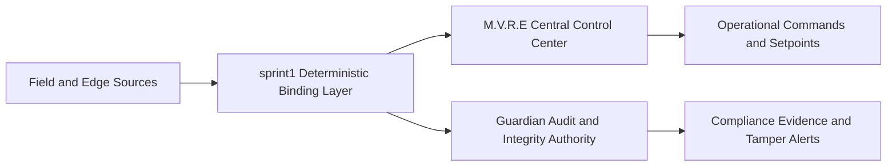
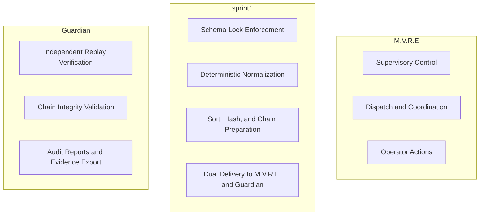
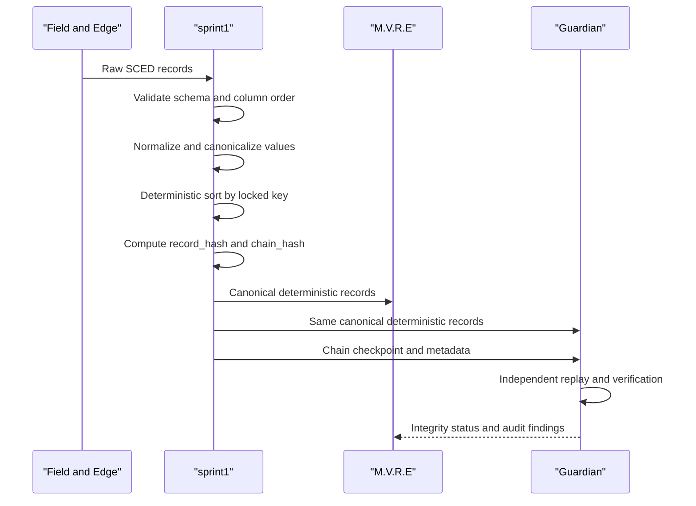
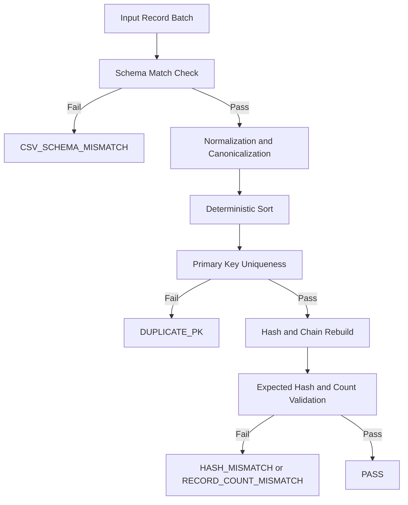

# M.V.R.E / sprint1 / Guardian Visual Architecture

Last reviewed: April 7, 2026

## High-Level Topology

## Responsibility Split

## Deterministic Data Path

## Verification Decision Flow

## Audit Boundary Guarantee
- `M.V.R.E` and `Guardian` consume the same deterministic payload from `sprint1`.
- `Guardian` does not trust operational state from `M.V.R.E`; it replays independently.
- Any single-field change must break deterministic replay and produce explicit failure codes.
